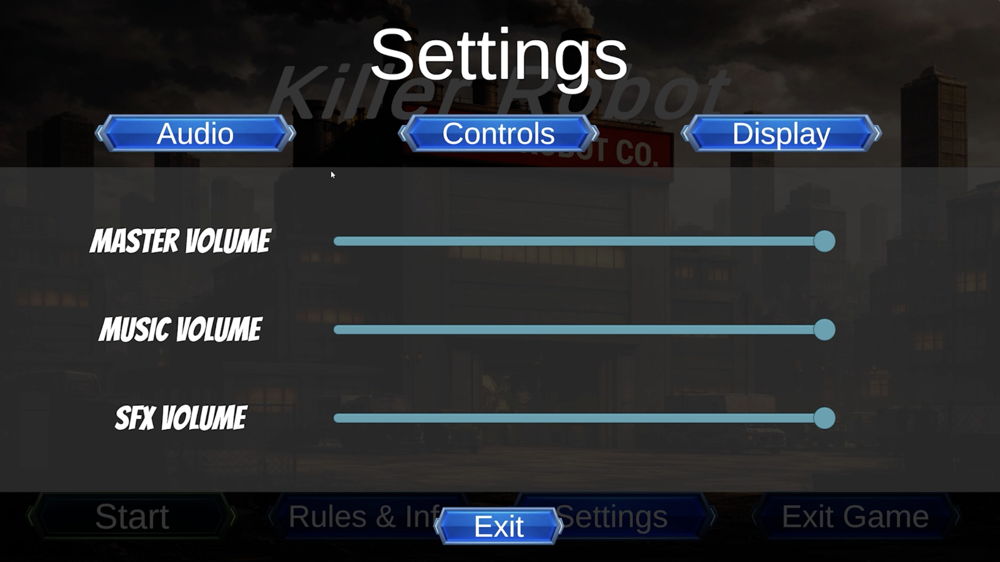
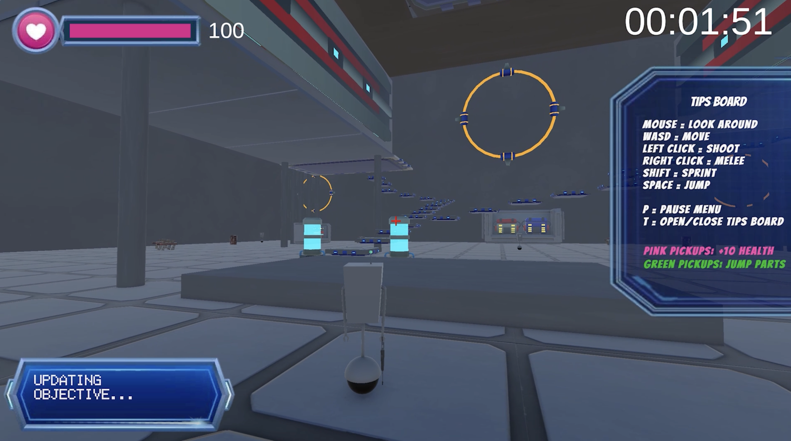
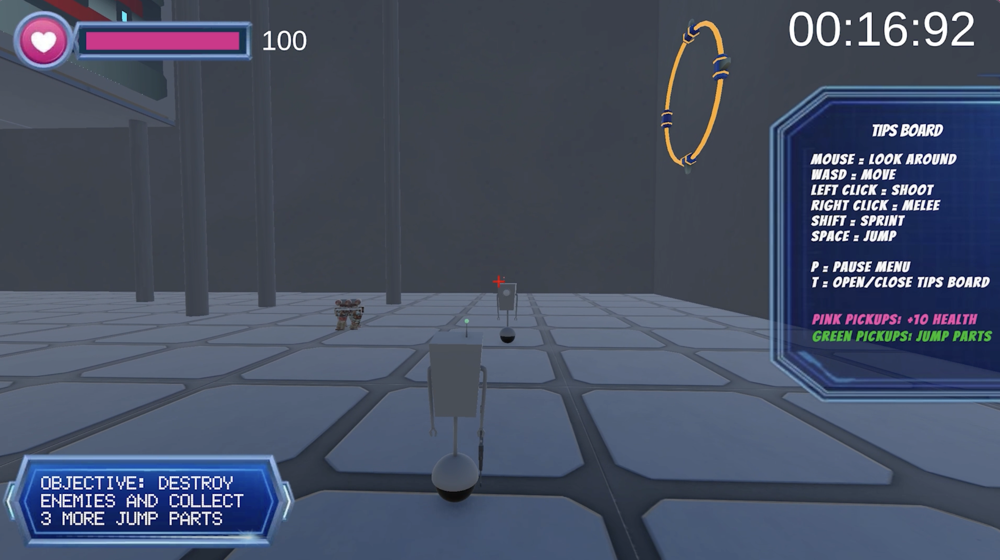
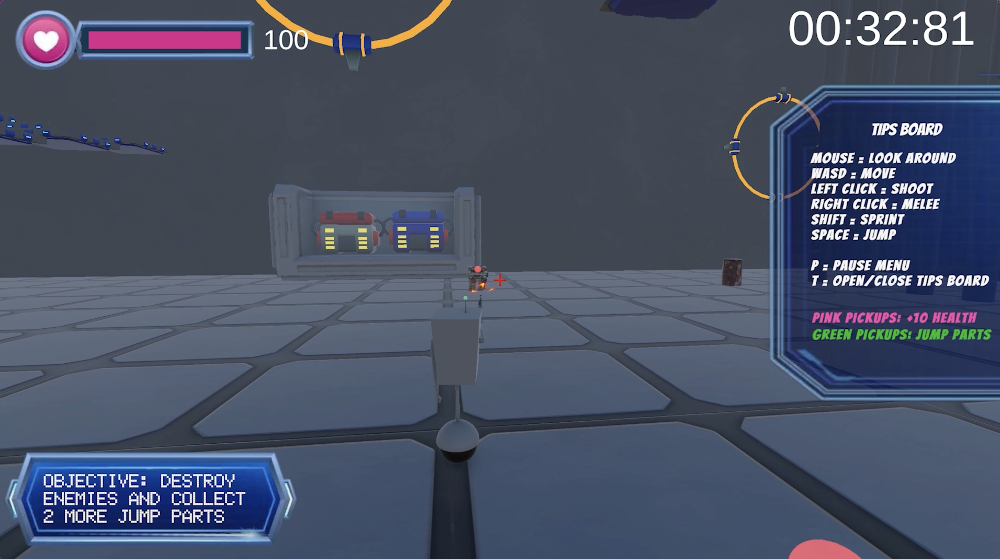
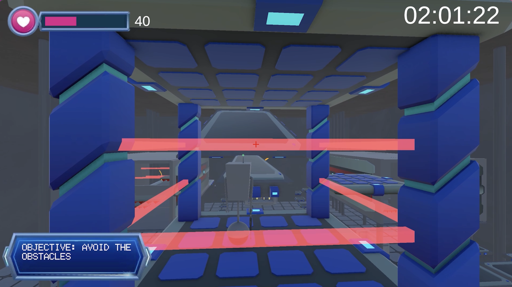
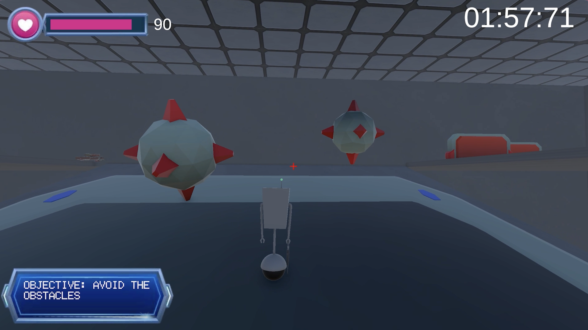
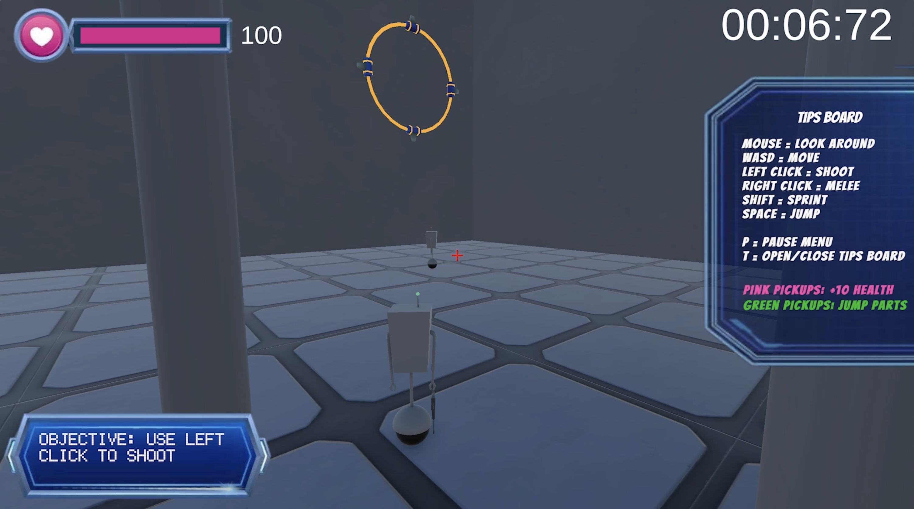
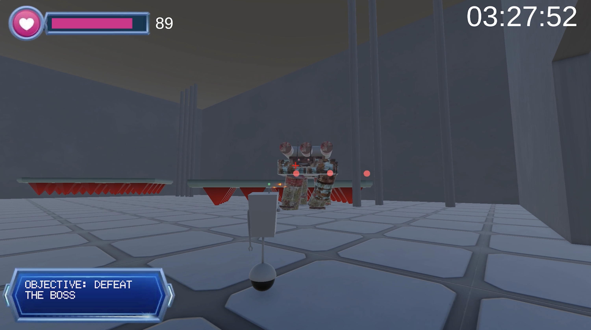
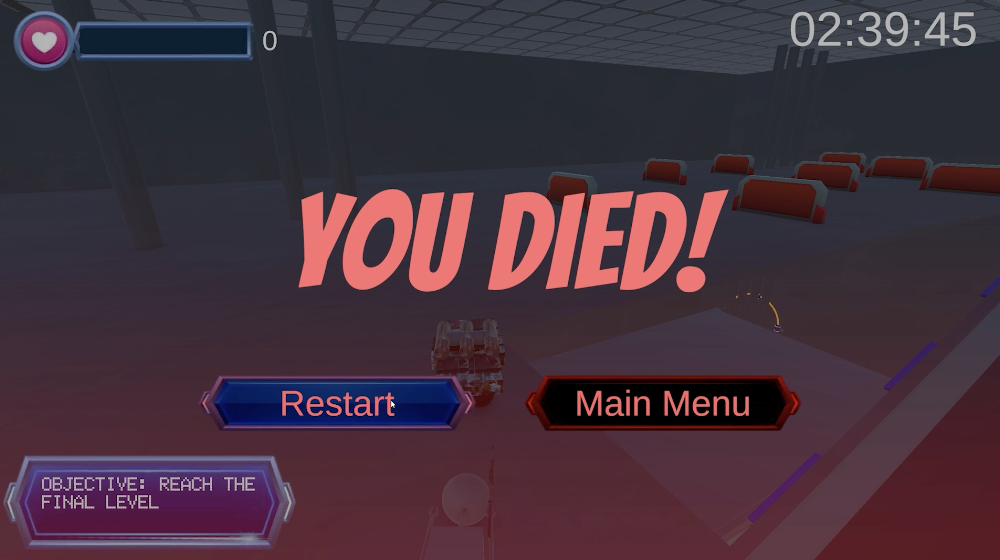

# Killer-Robot
A team-developed 3D action-platformer built in Unity featuring enemy AI, environmental obstacles, health and objective systems, interactive UI, audio controls, and a final boss encounter.

> **Project status:** Completed course project    
> **Course:** CS 6457 - Video Game Design    
> **Institution:** Georgia Institute of Technology   
> **Engine:** Unity    
> **Genre:** 3D action-platformer  
> **Platform:** PC and macOS

<p align="center">
  
</p>

## Gameplay Overview

The player awakens inside a dangerous robotics facility and must find a way out. Progress requires exploring the environment, overcoming moving obstacles, fighting enemy robots, and collecting three jump parts. After restoring the required abilities, the player must defeat the final boss and escape the facility.

### Main Objectives

- Explore the robot facility.
- Avoid lasers, pistons, moving platforms, rolling hazards, and other obstacles.
- Defeat hostile robots.
- Complete objectives.
- Reach and defeat the final boss.
- Escape the facility.

### Gameplay Video

- [Watch the gameplay trailer] https://drive.google.com/file/d/1DtgiNeJSkqpNrU27i16E_-0bm0vYZHr4/view?usp=sharing
- [Watch the complete playthrough] https://drive.google.com/file/d/1wk43S_S7r7g4-o7MMRR1-AgMiF8zgm_t/view?usp=sharing

## Features

- Third-person player movement and combat
- Enemy robots that follow and damage the player
- Health, damage, healing, and death systems
- Dynamic objective tracking
- Collectible jump parts
- Elevators and moving platforms that carry the player
- Rotating lasers and environmental damage
- Sliding blockers and crushing pistons
- Randomized rolling-ball hazards
- Health pickups
- Pause, death, and victory menus
- Final boss encounter
- Timer and gameplay HUD
- Music and sound-effect controls
- Adjustable mouse sensitivity
- Resolution, quality, and fullscreen settings
- Persistent settings between scenes

## Screenshots

### Main Menu

<p align="center">
  
</p>

<p align="center">
  
  
</p>

### Gameplay

<p align="center">
  
  
</p>

<p align="center">
  
  
</p>

<p align="center">
  
  
</p>

### Boss and End Screens

<p align="center">
  
  
</p>

<p align="center">
  
</p>

## Controls

| Action | Control |
|---|---|
| Move | `W`, `A`, `S`, `D` |
| Look | Mouse |
| Jump | `Space` |
| Sprint | `Shift` |
| Attack / Shoot | Left mouse button |
| Meele Attack / Hit | Right mouse button |
| Pause | `P` |

## My Contributions

My primary responsibilities included environmental obstacles, gameplay UI, menus, settings, audio integration, and supporting gameplay systems.

### Obstacles and Gameplay Systems

- Created the elevator system and player-carry behavior.
- Developed moving platforms and moving-step obstacles.
- Implemented rotating lasers and environmental damage.
- Created sliding blockers and crushing pistons.
- Developed randomized rolling-ball spawning and despawning.
- Added health pickups and enemy contact damage.
- Connected the boss defeat state to the victory screen.

### User Interface

- Created the start menu, pause menu, death panel, and victory panel.
- Implemented the player health bar and damage feedback.
- Added the gameplay timer.
- Created the dynamic objective tracker for enemies and jump parts.
- Managed cursor locking and gameplay input while menus were open.

### Audio and Settings

- Integrated music and sound effects with Unity's `AudioMixer`.
- Added master, music, and sound-effect volume controls.
- Added sensitivity, resolution, quality, and fullscreen settings.
- Implemented persistent settings across scenes.
- Added separate death and victory audio behavior.

## Technology Used

- Unity
- C#
- Universal Render Pipeline
- Cinemachine
- Unity AudioMixer
- Git and GitHub
- Git LFS

## Project Structure

The most important Unity project folders are:

```text
Killer-Robot/
├── Assets/
├── Packages/
├── ProjectSettings/
├── Documentation/
├── Test Assets/
├── Build/
├── PlayTest Data/
├── .gitignore
├── .gitattributes
└── README.md
```

Unity-generated folders such as `Library`, `Temp`, `Logs`, and `Obj` are intentionally excluded through the Unity `.gitignore`.

## Opening the Project

1. Clone the repository:

   ```bash
   git clone https://github.com/madelineluna/Killer-Robot.git
   ```

2. Open Unity Hub.
3. Select **Add project from disk**.
4. Choose the cloned `Killer-Robot` folder.
5. Open the project using the Unity version listed in:

   ```text
   ProjectSettings/ProjectVersion.txt
   ```

6. Open the main menu or gameplay scene from the `Assets` folder.
7. Press **Play** in the Unity Editor.

## Team and Credits

Killer Robot was originally created as a collaborative school project.

***Group Members:***
- Madeline Luna  
- Audrey Brainerd  
- Joshua Newsome  
- Mariana Zornes  
- Sam Mohseni   

Contributions are listed in the file:
  ```text
   LevelOneLegends_KillerRobot_readme.txt
   ```

Please preserve credit for every original contributor when sharing or modifying the project.

## Third-Party Assets

This project may contain third-party Unity assets, models, textures, sounds, animations, or packages. Ownership remains with their original creators.

## License

This repository currently has no open-source license. The project was created collaboratively, so its code and assets should not be reused, redistributed, or relicensed without permission from the contributors and the owners of any third-party assets.
